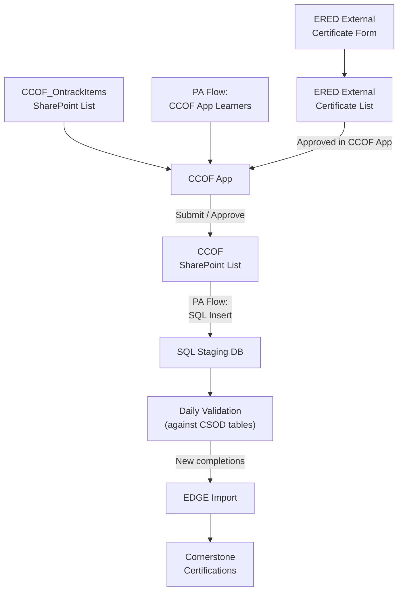

# Off-Site ERED Completion Process

**Purpose**  
Credit staff for ERED classes taken outside Fairview and keep certifications current.

---

## 1. Scope
- Employees: All Fairview staff taking ERED courses externally  
- Systems: 
	- ERED Class Form
	- CCOF app
	- SharePoint Lists
	- Power Automate Flows
	- SQL staging DB
	- EDGE Import
	- Cornerstone LMS

## 2. Actors & Roles
| Role | Responsibilities | Links/Refs |
|------|------------------|------------|
| Employee | Submit completion via ERED Class Form | [External Class Entry Form](https://mnfhs.sharepoint.com/:l:/s/LMSTeam/FKm7BHThqKRKmGmfO5CSrssB1u2Xrzu4x0nFNwqfasiDIQ?nav=ZjhhMTI1NGUtZmY5ZS00NTc0LWI1N2EtMzBmZGNjMjFkZWI1) |
| ERED Staff | Enter completions in CCOF and Approve Employee Entries | [CCOF App](https://apps.powerapps.com/play/e/default-c69834d0-4147-4777-891d-a7dcdee2d566/a/c13820ad-877d-4b2c-a101-064ea00b3ff1?tenantId=c69834d0-4147-4777-891d-a7dcdee2d566&hint=044d3555-f193-4c44-80e2-1411060e5b0b&sourcetime=1749050068754&source=portal) |
| HR Rep | Enter completions in CCOF | [CCOF App](https://apps.powerapps.com/play/e/default-c69834d0-4147-4777-891d-a7dcdee2d566/a/c13820ad-877d-4b2c-a101-064ea00b3ff1?tenantId=c69834d0-4147-4777-891d-a7dcdee2d566&hint=044d3555-f193-4c44-80e2-1411060e5b0b&sourcetime=1749050068754&source=portal) |
| LMS Admin | Monitor system |  |

## 3. Workflow Diagram

## 4. Step-by-Step

1. **Submission  
   - **Form:** User completes *ERED Class Form* and ERED approves entry
   - **App:** HR/ERED enters record in *CCOF*

2. **Validation & Staging**  
   `sproc_LogOntrackCompletionsValidation` checks userid, certification item, and completion/scheduled dates against cornerstone tables.

3. **EDGE Import**  
   - Schedule: Daily @ 04:00 PM CST  
   - Feed: `BLS_Material`, `CCOF Groups`

4. **Cornerstone Processing**  
   - Dynamic Certification Assignment to `ccof_*` Groups

## 5. Automation Components
### SQL Stored Procedures
| Sproc | Purpose | Trigger |
|-------|---------|---------|
| `sproc_LogOntrackCompletionsValidation` | Updates validation date and validation status in `log_ontrackcompletions` SQL table | [ccof_RunReport_WaitingForValidation](https://make.powerautomate.com/environments/Default-c69834d0-4147-4777-891d-a7dcdee2d566/flows/shared/cc7b5fcd-467a-4b76-8de5-704f774edabf/details) |
| `sproc_RunReport_OntrackCompletionsWaitingForValidation` | Runs report of active, unvalidated entries | [ccof_RunReport_WaitingForValidation](https://make.powerautomate.com/environments/Default-c69834d0-4147-4777-891d-a7dcdee2d566/flows/shared/cc7b5fcd-467a-4b76-8de5-704f774edabf/details) |
| `sproc_SharePointList_UpdateCCOFValidation` | Updates validation status and learner active status in [CCOF sharepoint list](https://mnfhs.sharepoint.com/sites/LMSTeam/Lists/powerapp_CCOF/AllItems.aspx) | [ccof_RunReport_WaitingForValidation](https://make.powerautomate.com/environments/Default-c69834d0-4147-4777-891d-a7dcdee2d566/flows/shared/cc7b5fcd-467a-4b76-8de5-704f774edabf/details) |
| `sproc_RunReport_CCOFEdgeImport` | Runs data to add learners to groups for dynamic certification assignment and material transcript Edge Imports | [ccof_EdgeImport](https://make.powerautomate.com/environments/Default-c69834d0-4147-4777-891d-a7dcdee2d566/flows/a016dcf0-b4ee-41e4-b90a-f8886e553db7/details) |
| `sproc_SendNotifications_NewCCOFCardSubmitted` | Field checks, dupes | [sproc_SendNotifications_NewCCOFCardSubmitted](https://make.powerautomate.com/environments/Default-c69834d0-4147-4777-891d-a7dcdee2d566/flows/shared/e1f2d902-e1d3-40be-8da9-0735ffeece0d/details) |

### Power Automate Flows
| Flow | Runs When | Action | URL|
|------|-----------|--------|--------|
| `ccof_RunReport_AppLearners` | Daily @ 2:59 AM | Save CCOFAllLearners.txt json file with learners to [LearningManagementSystem/Shared Documents/PowerApp Files/CCOFAllLearners.txt](https://mnfhs.sharepoint.com/sites/LearningManagementSystem/Shared%20Documents/Forms/AllItems.aspx?id=%2Fsites%2FLearningManagementSystem%2FShared%20Documents%2FPowerApp%20Files&viewid=c06de46c%2D501e%2D42d5%2D918c%2Db7d27e461ab8) | [ccof_RunReport_AppLearners](https://make.powerautomate.com/environments/Default-c69834d0-4147-4777-891d-a7dcdee2d566/flows/shared/23de6a53-079f-443f-b7fa-32fb782aeadb/details?v3=false) |
| `ccof_powerapps_GetLearners` | On load of the PowerApp | Load CCOFAllLearners.txt JSON into collection | [ccof_powerapps_GetLearners](https://make.powerautomate.com/environments/Default-c69834d0-4147-4777-891d-a7dcdee2d566/flows/shared/14a3fd70-97ef-490a-ba4a-915a43225d2a/details) |
| `ccof_powerapps_New` | On new item in [CCOF sharepoint list](https://mnfhs.sharepoint.com/sites/LMSTeam/Lists/powerapp_CCOF/AllItems.aspx) | Inserts item into `log_ontrackcompletions` SQL table | [ccof_powerapps_New](https://make.powerautomate.com/environments/Default-c69834d0-4147-4777-891d-a7dcdee2d566/flows/shared/764f24be-ce90-41dd-b435-beafc234ba4c/details) |
| `ccof_RunReport_WaitingForValidation` | Daily @ 7:00 AM | Runs `sproc_LogOntrackCompletionsValidation` to validate items in `log_ontrackcompletions` SQL table, the runs `sproc_RunReport_OntrackCompletionsWaitingForValidation` and saves as csv in scripts/output, then runs `sproc_SharePointList_UpdateCCOFValidation` to update validation details and active status in the [CCOF sharepoint list](https://mnfhs.sharepoint.com/sites/LMSTeam/Lists/powerapp_CCOF/AllItems.aspx) | [ccof_RunReport_WaitingForValidation](https://make.powerautomate.com/environments/Default-c69834d0-4147-4777-891d-a7dcdee2d566/flows/shared/cc7b5fcd-467a-4b76-8de5-704f774edabf/details) |
| `ccof_EdgeImport` | Daily @ 4:00 PM | Runs `sproc_RunReport_CCOFEdgeImport` and publishes Group and Material Transcript files to CSOD FTP server | [ccof_EdgeImport](https://make.powerautomate.com/environments/Default-c69834d0-4147-4777-891d-a7dcdee2d566/flows/a016dcf0-b4ee-41e4-b90a-f8886e553db7/details) |
| `ccof_powerapps_DeleteEntry` | When an item is deleted in [CCOF sharepoint list](https://mnfhs.sharepoint.com/sites/LMSTeam/Lists/powerapp_CCOF/AllItems.aspx) | Deletes corresponding item in `log_ontrackcompletions` SQL table | [ccof_powerapps_DeleteEntry](https://make.powerautomate.com/environments/Default-c69834d0-4147-4777-891d-a7dcdee2d566/flows/shared/88727091-3e4f-4655-97a8-7f4c7aef98cc/details) |
| `ccof_SendNotifications_NewCardSubmitted` | Daily @ 9:05 AM | Runs `sproc_SendNotifications_NewCCOFCardSubmitted` and sends survey via email to staff who submitted external card | [sproc_SendNotifications_NewCCOFCardSubmitted](https://make.powerautomate.com/environments/Default-c69834d0-4147-4777-891d-a7dcdee2d566/flows/shared/e1f2d902-e1d3-40be-8da9-0735ffeece0d/details) |

### EDGE Import Config
- **Template:** `ERED_Completions.xml`  
- **Frequency:** Daily 02:00 CST  
- **Expected volume:** ≤ 200 rows/day

## 5. Change Log
| Date | Change | Author |
|------|--------|--------|
| 2025-06-04 | Initial doc | Alex Richardson|
